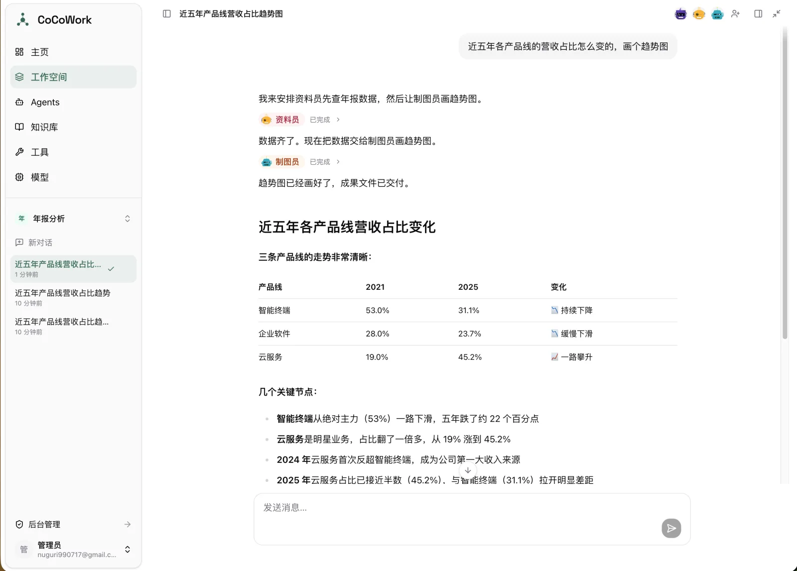
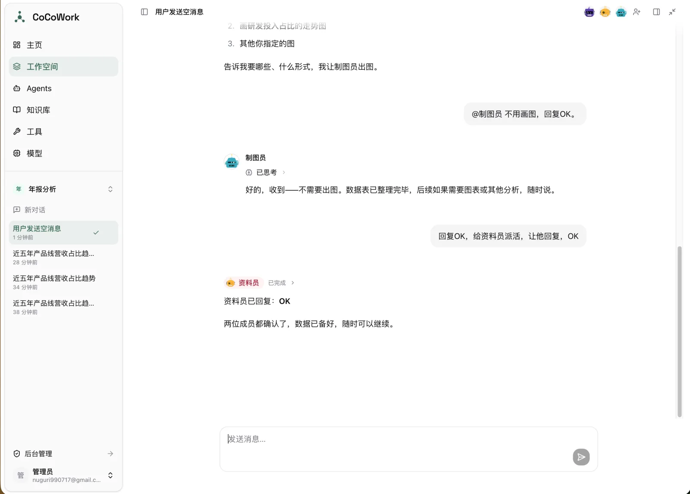
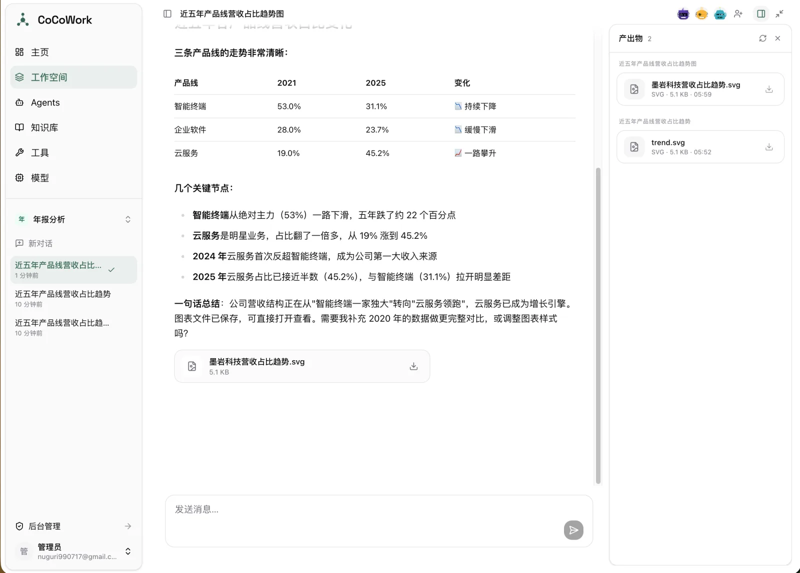
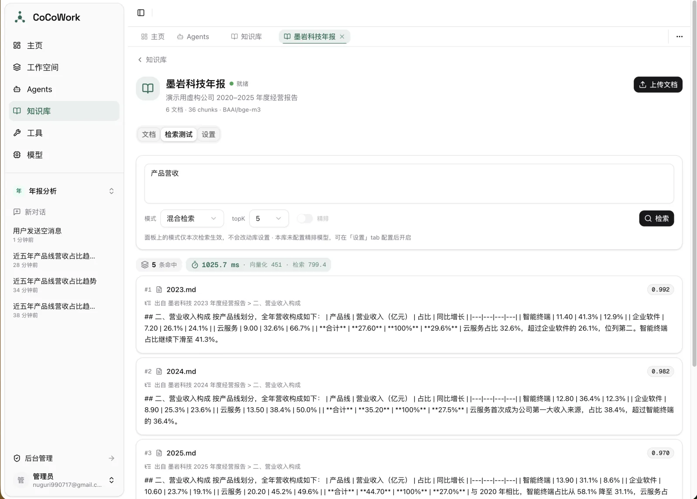
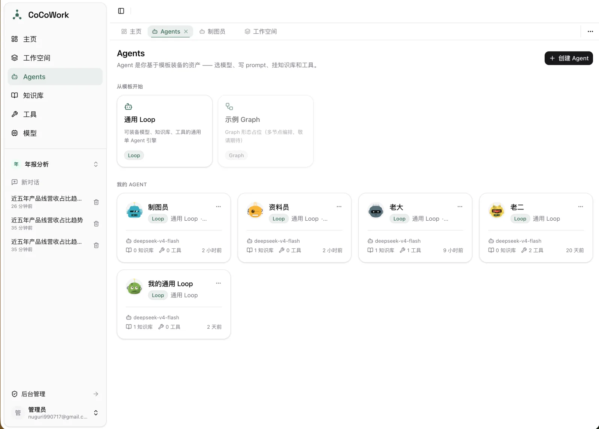

<div align="center">


# CoCoWork

**多 Agent 协作平台**

多个 Agent 在同一会话内协作 —— supervisor 调度 · @ 直连成员 · Agentic RAG · 沙箱产出物 · 跨会话记忆

[核心能力](#核心能力) · [技术栈](#技术栈) · [架构](#架构) · [快速开始](#快速开始) · [项目结构](#项目结构)




</div>

---

## 核心能力

### 多 Agent 协作

supervisor 接收指令后拆解任务并分派至成员，成员独立执行并回报结果，由 supervisor 汇总。执行过程完整可见：工具调用、中间产出与失败重试实时展开于对话流。

成员执行失败经 fallback 转为一条消息交回 supervisor，不中断整轮回复；supervisor 据此改派或如实告知。

### @ 直连成员

`@` 指定成员可绕过调度层直接对话。历史在送入模型前按应答者视角重写：本人发言保持原样，第三方发言标注来源，指派给本人的任务转为第二人称。



### 沙箱与产出物

挂载 Skill 的 Agent 在一次性 Docker 容器内执行脚本，交付区文件被收集为产出物，落对象存储并以卡片形式呈现于对话。产出物跨对话聚合于右侧面板，可拖回输入框复用，文件字节不经浏览器中转。

容器工作区每轮回复重置，历史文件经工具按需取回。



### Agentic RAG

知识库不以「检索结果拼进 system prompt」的方式接入，而是**每个知识库封装为一个独立工具**（retriever tool）交给模型：检索时机、检索内容、是否需要多次检索、跨哪几个库检索，均由模型在推理过程中自行决定。

工具描述携带知识库的名称与简介，模型据此判断该查哪个库。多个知识库挂载于同一 Agent 时，模型可按需分别调用。

底层检索支持三种模式：

| 模式 | 实现 |
|---|---|
| 向量检索 | pgvector HNSW 索引，余弦距离 |
| 全文检索 | tsvector + GIN 索引，jieba 分词，TF-IDF 查询提纯 |
| 混合检索 | 双路并发 + 加权 RRF 融合 |

检索结果可经 rerank 模型精排。命中测试独立计量向量化与检索耗时。



### Agent 装配

Agent 基于模板装配：绑定模型、配置 system prompt、挂载知识库、内置工具、MCP server 与 Skill。所有资源在装配阶段统一收敛为工具集交给模型，来源差异对模型透明。



### 其他

- **人工确认（HITL）** — Agent 执行中可中断并向用户提问，用户作答后自中断点续跑，页面刷新不丢失表单状态
- **跨会话记忆** — 用户级与工作空间级双尺度，由后台任务定期整理，亦可由 Agent 主动写入
- **上下文工程** — 单次回复内的工具输出截断、跨回复历史压缩、按视角重写的行动痕迹回放
- **多会话并发** — 切换对话不中断进行中的流，后台持续落库

---

## 技术栈

| 层 | 技术 |
|---|---|
| 后端 | FastAPI · Tortoise ORM · Pydantic |
| Agent | LangGraph · LangChain · deepagents · langchain-mcp-adapters |
| 存储 | PostgreSQL + pgvector · Redis · Cloudflare R2 / 本地存储 |
| 异步任务 | SAQ（文档处理 · 记忆整理 · 存档清理） |
| 沙箱 | Docker SDK，由独立进程持有 |
| 前端 | React 19 · TypeScript · Vite · TanStack Router · Zustand · Tailwind CSS v4 · shadcn/ui |
| 编辑器 | TipTap |
| 工具链 | uv · npm |

---

## 架构

```
┌──────────┐   ┌──────────┐   ┌────────────┐
│   web    │   │  worker  │   │  sandboxd  │
│ FastAPI  │   │   SAQ    │   │ Docker SDK │
└────┬─────┘   └────┬─────┘   └──────┬─────┘
     │  入队         │  取任务         │  独占 Docker
     └───────┬───────┘                │
             ▼                        │
       ┌──────────┐                   │
       │  Redis   │                   │
       └──────────┘                   │
             │                        │
     ┌───────┴────────────────────────┘
     ▼
┌──────────────────────────┐
│  PostgreSQL + pgvector   │
│  业务数据 · 向量 · 全文索引 │
└──────────────────────────┘
```

- **web** — HTTP 接口与 SSE 流式对话，Agent 于此进程内执行
- **worker** — 文档处理、记忆整理、存档清理等耗时任务，与 web 共用同一 Redis 队列
- **sandboxd** — 唯一持有 Docker SDK 的进程，容器生命周期全部经此，其余进程不直接接触 Docker

对话数据流：用户消息落库 → 装配 Agent（模型、工具、知识库、Skill）→ LangGraph 执行 → 事件流一份推送前端、一份旁路落库 → 流结束写入完整消息。

---

## 快速开始

### 前置条件

| 依赖 | 版本 |
|---|---|
| Python | ≥ 3.12，由 [uv](https://docs.astral.sh/uv/) 管理 |
| Node.js | ^20.19 \|\| ≥ 22.12 |
| PostgreSQL | 需启用 `pgvector` 扩展 |
| Redis | — |
| Docker | 可选，Skill 沙箱需要 |

### 后端

```bash
cd backend
uv sync
cp .env.example .env
```

编辑 `.env`，至少填写 `PG_*`、`REDIS_*` 与 `SECRET_KEY`，随后执行迁移并启动：

```bash
uv run tortoise upgrade
uv run dev
```

服务监听 `http://localhost:7999`，首次启动自动创建 `.env` 中配置的管理员账号。

### 前端

```bash
cd frontend
npm install
npm run dev
```

访问 `http://localhost:7777`，开发服务器将 `/api` 代理至后端 7999 端口。

### 异步任务与沙箱

文档向量化、记忆整理等任务需要 worker 进程：

```bash
uv run worker
```

Skill 沙箱需要 sandboxd，要求本机 Docker 可用：

```bash
uv run sandboxd
```

> [!IMPORTANT]
> worker 的任务清单于启动时读入内存，新增任务后须重启 worker。

---

## 项目结构

```
CoCoWork/
├── backend/
│   ├── app/
│   │   ├── agents/
│   │   │   ├── runtime/        # 通用对话运行时，不耦合业务场景
│   │   │   ├── templates/      # Agent 模板：loop 引擎 + graph 模板
│   │   │   └── workspace/      # 工作空间图：supervisor 调度 + 视角化上下文
│   │   ├── api/routes/         # 路由，按业务域拆分
│   │   ├── core/               # 配置、认证、存储抽象、异常、中间件
│   │   ├── models/             # Tortoise ORM 模型
│   │   ├── schemas/            # Pydantic 请求 / 响应
│   │   ├── services/
│   │   │   ├── knowledge/      # 文档处理管线 + 检索策略
│   │   │   ├── sandbox/        # 沙箱会话与产物
│   │   │   └── workspace/      # 工作空间、对话、消息、成员
│   │   ├── skills/builtin/     # 内置 Skill
│   │   ├── tasks/              # SAQ 异步任务
│   │   └── tools/              # 内置工具
│   └── migrations/
└── frontend/
    └── src/
        ├── api/                # 后端接口封装
        ├── components/
        │   ├── chat/           # 通用对话层
        │   └── ui/             # shadcn/ui
        ├── pages/
        ├── routes/             # TanStack Router 文件式路由
        └── stores/             # Zustand
```

---

## License

[MIT](LICENSE)
